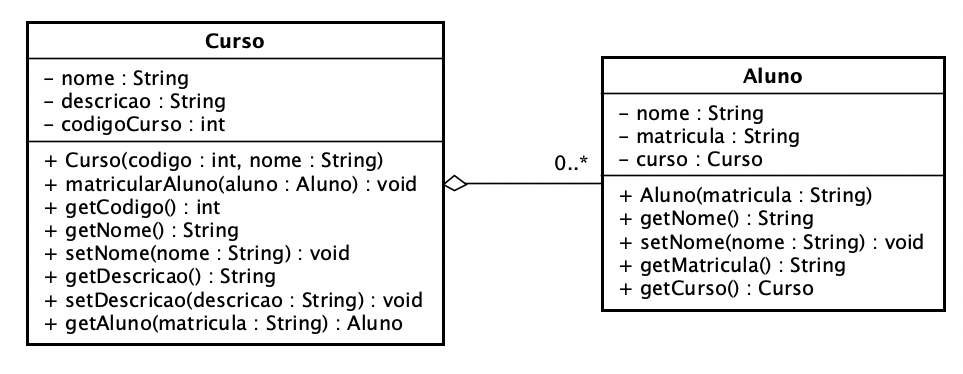

**Universidade Federal da Paraíba - UFPB** \
**Centro de Ciências Exatas e Educação - CCAE** \
**Departamento de Ciências Exatas - DCX**

**Professor:** [Rodrigo Rebouças de Almeida](http://rodrigor.dcx.ufpb.br)

# Atividade Curso - Alunos

Implemente as classes descritas no diagrama a seguir.

Siga estritamente o que está modelado. Apenas os métodos e construtores que estão especificados no diagrama.

